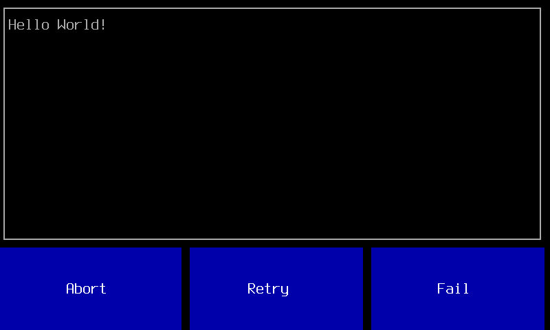

TerminalButtons.jl

Terminal-mode Push Buttons for Linux Touch Screens.

Create simple touch screen interfaces without X11.

Uses [LinuxTouchEvents.jl](https://github.com/notinaboat/LinuxTouchEvents.jl) to get touch screen input (e.g from a [Raspberry Pi Touch Display](https://www.raspberrypi.org/documentation/hardware/display/README.md)).

Uses [TerminalUserInterfaces.jl](https://github.com/kdheepak/TerminalUserInterfaces.jl) to draw buttons.




## Interface


```
choose_button([button, button, ...]) -> selected_button
```

Draw a selection of buttons and wait for one of them to be pressed.

e.g.

```
TerminalUserInterfaces.initialize()

t = TerminalUserInterfaces.Terminal()

x = TerminalButtons.choose_button(t, ["Abort", "Retry", "Fail"])
if x == "Abort"
    ...
elseif x == "Retry"
    ...
elseif x == "Fail"
    ...
end

TerminalUserInterfaces.cleanup()
```

